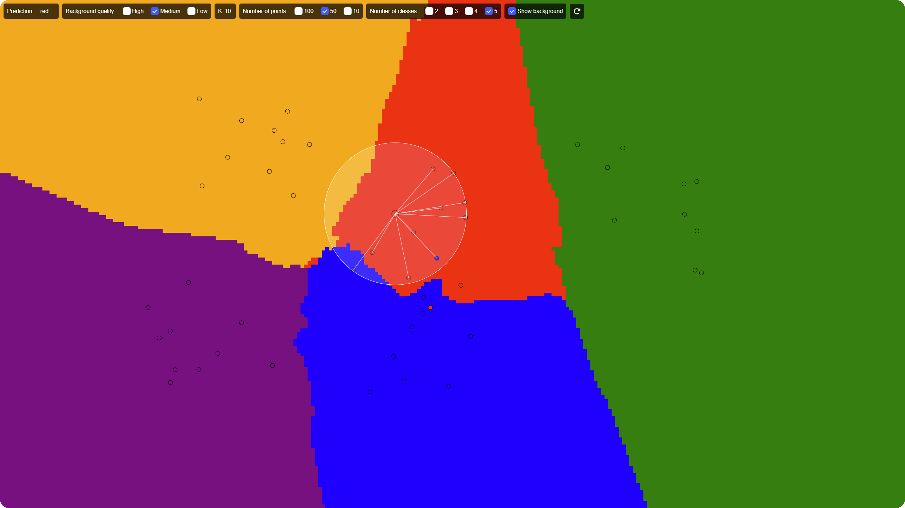

# KNN Visualizer

KNN-Visualizer is a simple tool to visualize the K-Nearest Neighbors algorithm in 2D in real time, both on PC and mobile.

  

## Summary

### 1. [Features](#1---features)

### 2. [Improve the project](#2---improve-the-project)

### 3. [Credits](#3---credits)

## 1 - Features

- The algorithm is visualized in real time, so you can see how it works

- You can change the number of neighbors (k) and the number of points dynamically with the wheel (not on mobile)

- You chan choose between 2, 3, 4 or 5 classes

- You can choose between 10, 50 or 100 points

- Show the background with all the predictions

- Change the position of the points without reloading the page

## 2 - Improve the project

If you like this project and/or want to help or improve it, you can:

- Create an issue if you find a bug or want to suggest a feature or any improvement (no matter how small it is).

- Create a pull request if you want to add a feature, fix a bug or improve the code.

- Contact me if you want to talk about the project or anything else (Discord: pietot).

> **Note**: If you want to be guided/helped, you already have a file named <a href="improvements.txt">improvements.txt</a> in the project directory, where you can see all the improvements that can be made.

## 3 - Credits

- **[Original website](http://vision.stanford.edu/teaching/cs231n-demos/knn/)**: The original website where I partially got the idea of the project.
- **[Original design](https://codepen.io/gangtao/pen/PPoqMW)**: The codepen that inspired me the design of the website.
